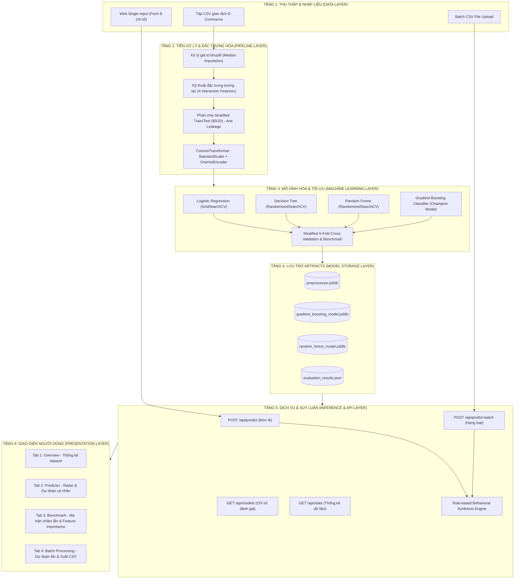

# BÁO CÁO TOÀN DIỆN DỰ ÁN: BOOMERANG RADAR AI
## HỆ THỐNG TRÍ TUỆ NHÂN TẠO DỰ ĐOÁN KHẢ NĂNG QUAY LẠI VÀ NGUY CƠ RỜI BỎ CỦA KHÁCH HÀNG

---

## MỤC LỤC
1. [Phát biểu bài toán](#1-phát-biểu-bài-toán)
2. [Xác định yêu cầu, Input, Output](#2-xác-định-yêu-cầu-input-output)
3. [Sơ đồ khối hệ thống](#3-sơ-đồ-khối-hệ-thống)
4. [Mô tả thuật toán](#4-mô-tả-thuật-toán)
5. [Mô tả dữ liệu (Dataset)](#5-mô-tả-dữ-liệu-dataset)
6. [Cài đặt hệ thống (Implementation)](#6-cài-đặt-hệ-thống-implementation)
7. [Đánh giá kết quả thực nghiệm](#7-đánh-giá-kết-quả-thực-nghiệm)
8. [Hướng phát triển](#8-hướng-phát-triển)

---

## 1. PHÁT BIỂU BÀI TOÁN

### 1.1. Bối cảnh thực tiễn & Nhu cầu doanh nghiệp
Trong hoạt động bán lẻ và thương mại điện tử (E-Commerce), việc giữ chân khách hàng (Customer Retention) đóng vai trò quyết định đến sự sống còn và biên lợi nhuận của doanh nghiệp:
* **Chi phí đắt đỏ:** Thu hút một khách hàng mới (Customer Acquisition Cost - CAC) tốn kém gấp **5 đến 7 lần** so với việc kích hoạt tái mua từ khách hàng cũ.
* **Tác động đòn bẩy lợi nhuận:** Theo nghiên cứu của Bain & Company, chỉ cần tăng tỉ lệ giữ chân khách hàng thêm **5%**, lợi nhuận doanh nghiệp có thể tăng từ **25% đến 95%**.
* **Vấn đề cốt lõi:** Đa phần doanh nghiệp hiện nay chăm sóc khách hàng một cách thụ động, chỉ phản ứng khi khách đã ngừng mua quá lâu (lúc này chi phí kéo khách quay lại cực kỳ cao hoặc bất khả thi).

### 1.2. Phát biểu bài toán theo góc nhìn Trí tuệ Nhân tạo
* **Định nghĩa:** Bài toán được mô hình hóa dưới dạng **Học máy có giám sát - Phân loại nhị phân (Supervised Binary Classification)**.
* Cho một tập quan sát hành vi của khách hàng $\mathbf{x} = [x_1, x_2, \dots, x_d] \in \mathbb{R}^d$, mục tiêu là tìm hàm mục tiêu:
  $$f: \mathbf{x} \mapsto \hat{y} \in \{0, 1\}$$
  đồng thời ước lượng xác suất hậu nghiệm:
  $$P(y = 1 \mid \mathbf{x})$$
  Trong đó:
  * $y = 1$: Khách hàng **sẽ quay lại mua sắm** trong chu kỳ dự báo (Repurchase / Retained).
  * $y = 0$: Khách hàng **không quay lại / có nguy cơ rời bỏ** (Churn / At-Risk).
* **Mục tiêu hệ thống "Boomerang Radar AI":**
  * Tự động quét và phát hiện sớm các dấu hiệu phai nhạt tương tác của khách hàng.
  * Đánh giá chính xác xác suất quay lại, gán nhãn rủi ro rời bỏ.
  * Tự động đề xuất kịch bản can thiệp kịp thời (voucher, tri ân VIP, hỗ trợ cá nhân hóa) trước khi khách hàng chuyển sang đối thủ cạnh tranh.

---

## 2. XÁC ĐỊNH YÊU CẦU, INPUT, OUTPUT

### 2.1. Yêu cầu hệ thống
#### a. Yêu cầu chức năng (Functional Requirements)
1. **Dự đoán thời gian thực (Real-time Single Inference):** Cho phép nhập thông tin của 1 khách hàng qua giao diện web hoặc REST API và trả về kết quả ngay lập tức kèm phân tích hành vi và đề xuất hành động.
2. **Dự đoán theo lô (Batch Processing):** Hỗ trợ tải tệp tin CSV chứa hàng nghìn bản ghi, hệ thống tự động tiền xử lý, suy luận song song và cho phép xuất kết quả (Export CSV).
3. **Trực quan hóa và so sánh mô hình (Model Benchmarking):** Hiển thị bảng chỉ số kiểm thử, ma trận nhầm lẫn (Confusion Matrix) và biểu đồ xếp hạng độ quan trọng của các đặc trưng (Feature Importance).
4. **Báo cáo tổng quan dữ liệu (Data Overview):** Thống kê số lượng, tỉ lệ khách rời bỏ, giá trị đơn hàng trung bình và xem trước dữ liệu mẫu.

#### b. Yêu cầu phi chức năng (Non-Functional Requirements)
* **Độ chính xác cao:** Mô hình tốt nhất phải đạt $F_1\text{-Score} \ge 92\%$, $\text{Accuracy} \ge 90\%$, $\text{ROC-AUC} \ge 0.90$.
* **Độ trễ thấp (Low Latency):** Phản hồi suy luận đơn lẻ $< 100\text{ms}$.
* **Bảo vệ tính toàn vẹn dữ liệu (Anti-Data Leakage):** Tuyệt đối không để rò rỉ phân phối dữ liệu tập Test vào tập Train trong quá trình tiền xử lý và kỹ thuật đặc trưng.
* **Giao diện thân thiện:** Web Dashboard responsive, trực quan, dễ thao tác cho cả nhân sự kỹ thuật lẫn bộ phận Marketing/CSKH.

### 2.2. Xác định Input (Đặc tả dữ liệu đầu vào)
Hệ thống tiếp nhận 8 đặc trưng đầu vào chuẩn hóa RFM+ và nhân khẩu học:

| STT | Tên thuộc tính | Kiểu dữ liệu | Miền giá trị | Nhóm đặc trưng | Diễn giải ý nghĩa |
| :---: | :--- | :---: | :---: | :--- | :--- |
| 1 | `age` | Integer | $18 - 70$ | Nhân khẩu học | Độ tuổi của khách hàng |
| 2 | `gender` | Categorical | `Nam`, `Nữ` | Nhân khẩu học | Giới tính khách hàng |
| 3 | `total_purchases` | Integer | $1 - 60$ | Tần suất (Frequency) | Tổng số đơn hàng đã hoàn tất |
| 4 | `avg_order_value` | Float | $150.000 - 4.500.000$ VNĐ | Giá trị (Monetary) | Giá trị trung bình mỗi đơn hàng |
| 5 | `days_since_last_purchase` | Integer | $1 - 180$ | Độ mới (Recency) | Số ngày kể từ đơn hàng gần nhất |
| 6 | `membership_level` | Categorical | `Đồng`, `Bạc`, `Vàng`, `Kim Cương` | Khách hàng thân thiết | Hạng hội viên của khách hàng |
| 7 | `used_voucher` | Binary | $0$ hoặc $1$ | Hành vi khuyến mãi | $1$: Có áp dụng voucher, $0$: Không |
| 8 | `satisfaction_score` | Integer | $1 - 5$ | Trải nghiệm dịch vụ | Điểm hài lòng đánh giá (sao) |

### 2.3. Xác định Output (Đặc tả dữ liệu đầu ra)
Khi tiếp nhận Input, hệ thống tính toán và trả về cấu trúc dữ liệu gồm 5 thành phần chính:
1. **Xác suất quay lại ($P_{\text{return}}$) & Rủi ro rời bỏ ($P_{\text{churn}}$):** Giá trị phần trăm định lượng chính xác (ví dụ: $94.2\%$ khả năng quay lại, nguy cơ rời bỏ $5.8\%$).
2. **Nhãn dự đoán phân loại:**
   $$\hat{y} = \begin{cases} 1 & \text{nếu } P_{\text{return}} \ge \text{Threshold (mặc định } 0.50) \\ 0 & \text{nếu } P_{\text{return}} < \text{Threshold} \end{cases}$$
3. **Phân cấp mức độ rủi ro (Risk Level):**
   * *Rất Thấp:* $P_{\text{return}} > 80\%$ (Khách hàng cực kỳ trung thành).
   * *Trung Bình:* $50\% \le P_{\text{return}} \le 80\%$ (Có khả năng quay lại nhưng nhịp độ mua chậm).
   * *Cao:* $20\% \le P_{\text{return}} < 50\%$ (Bắt đầu phai nhạt, nguy cơ mất khách).
   * *Rất Cao (Nguy cơ Churn):* $P_{\text{return}} < 20\%$ (Báo động đỏ, chuẩn bị rời bỏ hẳn).
4. **Phân tích tổng hợp tự nhiên (Synthesis Analysis):** Chuỗi diễn giải đa chiều dựa trên quy tắc nghiệp vụ kết hợp (ví dụ: *"Mua rất ít (2 lần), giá trị đơn thấp (250.000 VNĐ), đã 4 tháng (120 ngày) không quay lại, điểm hài lòng thấp (2/5). Đặc biệt chỉ mua khi có mã giảm giá."*).
5. **Đề xuất hành động kinh doanh (Actionable Advice):** Hành động Marketing/CSKH cụ thể (ví dụ: kích hoạt chiến dịch Call-Center thăm hỏi, gửi Voucher 25%, nâng cấp quyền lợi VIP,...).

---

## 3. SƠ ĐỒ KHỐI HỆ THỐNG

### 3.1. Kiến trúc phân tầng tổng thể (System Architecture Diagram)



### 3.2. Luồng xử lý dữ liệu (Data Pipeline Flow)
1. Dữ liệu thô được đưa qua hàm `engineer_features()` để tính toán 4 biến tương tác phi tuyến.
2. Dữ liệu được chia theo nhãn phân tầng (`stratify=y`) đảm bảo tỉ lệ nhãn đồng nhất giữa Train và Test.
3. Bộ biến đổi `ColumnTransformer` áp dụng `StandardScaler` cho 10 biến số và `OneHotEncoder(drop='first')` cho 2 biến danh mục, sinh ra vector đặc trưng 14 chiều.
4. Quá trình huấn luyện sử dụng Stratified 5-Fold Cross-Validation để chống Overfitting và tìm kiếm siêu tham số tối ưu.
5. Mô hình tốt nhất được lưu lại cùng bộ `preprocessor` dưới định dạng `joblib` để sẵn sàng cho API suy luận không độ trễ.

---

## 4. MÔ TẢ THUẬT TOÁN

### 4.1. Kỹ thuật tạo đặc trưng tương tác (Interaction Features)
Thay vì chỉ cung cấp các đặc trưng thô, hệ thống tự động kỹ thuật hóa 4 đặc trưng tổng hợp nhằm mở khóa mối tương quan phi tuyến:

1. **Cường độ mua sắm (Purchase Intensity):**
   $$\text{purchase\_intensity} = \frac{\text{total\_purchases}}{\text{days\_since\_last\_purchase} + 1}$$
   *Ý nghĩa:* Thể hiện tần suất mua hàng trên đơn vị thời gian gần nhất. Khách mua nhiều đơn mà số ngày kể từ đơn cuối nhỏ sẽ có điểm cực cao, báo hiệu khách hàng đang trong chu kỳ mua sắm tích cực.

2. **Điểm giá trị vòng đời khách hàng (LTV Score):**
   $$\text{ltv\_score} = \frac{\text{total\_purchases} \times \text{avg\_order\_value}}{1.000.000} \quad (\text{đơn vị: triệu VNĐ})$$
   *Ý nghĩa:* Định lượng tổng giá trị doanh thu mà khách hàng đã đóng góp cho doanh nghiệp.

3. **Mức độ hài lòng theo thời gian (Satisfaction Recency):**
   $$\text{satisfaction\_recency} = \frac{\text{satisfaction\_score}}{\text{days\_since\_last\_purchase} + 1} \times 30$$
   *Ý nghĩa:* Kết hợp sự hài lòng với độ tươi mới của trải nghiệm. Điểm hài lòng cao nhưng đã quá nhiều ngày không quay lại sẽ suy giảm dần theo thời gian.

4. **Nhận diện nhóm săn khuyến mãi giá trị thấp (Voucher Low Value):**
   $$\text{voucher\_low\_value} = \text{used\_voucher} \times \mathbb{I}(\text{avg\_order\_value} \le 300.000)$$
   *Ý nghĩa:* Nhận diện nhóm khách hàng "nhạy cảm về giá", chỉ xuất hiện khi có voucher và chỉ mua đơn giá trị nhỏ, nhóm này có rủi ro rời bỏ cao khi hết chương trình khuyến mãi.

### 4.2. Chi tiết 4 thuật toán Machine Learning được triển khai

#### 1. Logistic Regression (Hồi quy Logistic)
* **Cơ chế:** Thiết lập ranh giới quyết định tuyến tính dựa trên hàm Sigmoid:
  $$P(y=1 \mid \mathbf{x}) = \sigma(\mathbf{w}^T \mathbf{x} + b) = \frac{1}{1 + e^{-(\mathbf{w}^T \mathbf{x} + b)}}$$
* **Hàm mất mát:** Binary Cross-Entropy kết hợp chuẩn hóa $L_2$:
  $$\mathcal{L}(\mathbf{w}) = -\frac{1}{N} \sum_{i=1}^N \left[ y_i \ln(\hat{y}_i) + (1 - y_i) \ln(1 - \hat{y}_i) \right] + \frac{1}{2C} \|\mathbf{w}\|_2^2$$
* **Tối ưu:** `GridSearchCV` trên không gian siêu tham số $C \in [0.001, 50.0]$ và solver `lbfgs`.
* **Vai trò:** Đóng vai trò mô hình chuẩn đối sánh (Baseline Model).

#### 2. Decision Tree (Cây quyết định)
* **Cơ chế:** Phân chia không gian đặc trưng đệ quy thành các siêu hình hộp chữ nhật dựa trên tiêu chí đo lường độ tinh khiết (Entropy / Information Gain):
  $$H(S) = -\sum_{c \in \{0, 1\}} p_c \log_2(p_c)$$
  $$\text{Gain}(S, A) = H(S) - \sum_{v \in \text{Values}(A)} \frac{|S_v|}{|S|} H(S_v)$$
* **Tối ưu:** `RandomizedSearchCV` tinh chỉnh `max_depth`, `min_samples_split`, `min_samples_leaf`, tiêu chí `entropy`.

#### 3. Random Forest (Rừng ngẫu nhiên)
* **Cơ chế:** Thuật toán học kết hợp nhóm (Ensemble Bagging - Bootstrap Aggregating). Xây dựng $B$ cây quyết định độc lập $\{T_1, T_2, \dots, T_B\}$.
* Mỗi cây được huấn luyện trên một tập con dữ liệu ngẫu nhiên có hoàn lại (Bootstrap Sample) và tại mỗi nút phân chia chỉ chọn ngẫu nhiên $m \le d$ đặc trưng.
* Dự đoán cuối cùng là kết quả biểu quyết đa số (Majority Voting) hoặc lấy trung bình xác suất:
  $$\hat{P}(y=1 \mid \mathbf{x}) = \frac{1}{B} \sum_{b=1}^B T_b(\mathbf{x})$$
* **Ưu điểm:** Giảm phương sai (Variance) cực tốt, hạn chế tối đa Overfitting.

#### 4. Gradient Boosting Classifier (Mô hình vô địch - Champion Model)
* **Cơ chế:** Kỹ thuật Boosting tuần tự (Sequential Boosting). Thay vì xây dựng các cây độc lập, Gradient Boosting xây dựng cây mới nhằm xấp xỉ phần dư (Residuals) hay gradient âm của hàm mất mát tạo ra bởi các cây trước đó:
  $$r_{im} = -\left[ \frac{\partial \mathcal{L}(y_i, F(x_i))}{\partial F(x_i)} \right]_{F(x) = F_{m-1}(x)}$$
* Mô hình được cập nhật theo cơ chế suy giảm (Shrinkage):
  $$F_m(x) = F_{m-1}(x) + \nu \sum_{j=1}^{J_m} \gamma_{jm} \mathbb{I}(x \in R_{jm})$$
  Trong đó $\nu \in (0, 1]$ là tốc độ học (Learning Rate).
* **Không gian tối ưu (RandomizedSearchCV - 80 lần lặp):**
  * `n_estimators`: 550 cây
  * `learning_rate`: 0.0562
  * `max_depth`: 14
  * `subsample`: 0.95 (Stochastic Gradient Boosting giúp tăng tính tổng quát)
  * `min_samples_split`: 3, `min_samples_leaf`: 1

---

## 5. MÔ TẢ DỮ LIỆU (DATASET)

### 5.1. Nguồn dữ liệu & Quy mô
* Dữ liệu được trích xuất và chuẩn hóa từ tập dữ liệu hành vi người tiêu dùng thương mại điện tử thực tế (*E-Commerce Customer Churn Dataset*).
* Tổng số quan sát: Hàng nghìn bản ghi khách hàng với đầy đủ thông tin giao dịch, hạng thẻ và phản hồi mức độ thỏa mãn dịch vụ.

### 5.2. Thống kê đặc trưng và phân phối nhãn
* **Tỉ lệ nhãn (Class Distribution):**
  * Nhãn $1$ (Quay lại mua sắm): Chiếm **$\approx 83.0\%$**
  * Nhãn $0$ (Rời bỏ / Churn): Chiếm **$\approx 17.0\%$**
  * *Nhận xét:* Dữ liệu phản ánh đúng bản chất mất cân bằng (Imbalanced) thực tế của bài toán kinh doanh. Vì vậy, chỉ số $F_1\text{-score}$ và $\text{ROC-AUC}$ được ưu tiên đánh giá hơn chỉ số Accuracy thuần túy.

* **Thống kê các trường dữ liệu tiêu biểu:**
  * `age`: Trung bình $39.2$ tuổi (trải dài từ 18 đến 70).
  * `avg_order_value`: Trung bình $1.768.000$ VNĐ (thấp nhất 150.000 VNĐ, cao nhất 4.500.000 VNĐ).
  * `total_purchases`: Dao động từ 1 đến 60 lần mua.
  * `days_since_last_purchase`: Phân bố từ 1 ngày đến 180 ngày.
  * `satisfaction_score`: Trải đều từ 1 sao đến 5 sao.

### 5.3. Quy trình tiền xử lý chống rò rỉ dữ liệu (Anti-Data Leakage)
Rò rỉ dữ liệu (Data Leakage) là lỗi nghiêm trọng phổ biến khiến mô hình đạt điểm cao khi kiểm thử nhưng sụp đổ trong môi trường thực tế. Hệ thống tuân thủ chặt chẽ:
1. **Phân tách trước khi biến đổi:** Tập dữ liệu được tách thành Train (80%) và Test (20%) trước khi tính toán bất kỳ giá trị thống kê nào.
2. **Học phân phối chỉ trên Train:** `StandardScaler` (tính $\mu, \sigma$) và `OneHotEncoder` chỉ gọi `.fit()` trên tập huấn luyện $X_{\text{train}}$.
3. **Áp dụng thuần túy trên Test:** Tập $X_{\text{test}}$ và các mẫu suy luận mới từ người dùng chỉ được chuyển đổi bằng phương thức `.transform()`.

---

## 6. CÀI ĐẶT HỆ THỐNG (IMPLEMENTATION)

### 6.1. Công nghệ & Thư viện sử dụng
* **Ngôn ngữ cốt lõi:** Python 3.10+
* **Xử lý dữ liệu & Tính toán số học:** `pandas`, `numpy`, `openpyxl`
* **Học máy & Đánh giá mô hình:** `scikit-learn`, `joblib`
* **Web Framework & REST API:** `Flask`, `jsonify`, `request`
* **Giao diện người dùng:** `HTML5`, `Bootstrap 5`, `Chart.js`, `FontAwesome 6`

### 6.2. Cấu trúc mô-đun mã nguồn
```text
Boomerang_Radar_AI/
│
├── app.py                          # Khởi tạo máy chủ Flask & các REST API Endpoints
├── requirements.txt                # Danh sách thư viện phụ thuộc
├── README.md                       # Tài liệu hướng dẫn cài đặt & vận hành
├── BAO_CAO_DU_AN_BOOMERANG_RADAR_AI.md # Báo cáo chi tiết kỹ thuật
│
├── data/
│   ├── customer_repurchase_data.csv    # Dữ liệu sạch chuẩn hóa (dùng cho huấn luyện & demo)
│   └── raw/                            # Thư mục chứa dữ liệu thô (.xlsx)
│
├── models/                         # Lưu trữ các file nhị phân sau huấn luyện
│   ├── gradient_boosting_model.joblib  # Mô hình vô địch (Champion Model)
│   ├── random_forest_model.joblib      # Mô hình đối sánh Random Forest
│   ├── decision_tree_model.joblib      # Mô hình đối sánh Decision Tree
│   ├── logistic_regression_model.joblib# Mô hình cơ sở Logistic Regression
│   ├── preprocessor.joblib             # Bộ chuyển đổi ColumnTransformer đã fit
│   ├── feature_names.joblib            # Danh sách 14 đặc trưng sau OneHotEncoding
│   ├── raw_feature_cols.joblib         # Danh sách 8 đặc trưng gốc
│   └── evaluation_results.json         # Báo cáo JSON lưu trữ metrics & feature importances
│
├── src/
│   ├── __init__.py
│   ├── data_processing.py          # Module nạp dữ liệu, FE và tiền xử lý chuẩn
│   ├── train.py                    # Pipeline huấn luyện, tối ưu siêu tham số & xuất model
│   └── predict.py                  # Module suy luận đơn lẻ, suy luận batch & logic phân tích
│
└── templates/
    └── index.html                  # Giao diện người dùng tích hợp Dashboard 4 phân hệ
```

### 6.3. Chi tiết chức năng từng module
* **`src/data_processing.py`:**
  * Hàm `engineer_features(df)`: Tự động tính 4 cột tương tác `purchase_intensity`, `ltv_score`, `satisfaction_recency`, `voucher_low_value`.
  * Hàm `prepare_data()`: Thực hiện phân chia Train/Test 80/20 có phân tầng, fit `ColumnTransformer` và lưu lại artifacts `preprocessor.joblib`.
* **`src/train.py`:**
  * Triển khai hàm `train_and_evaluate_models()` chạy tự động `GridSearchCV` và `RandomizedSearchCV` cho 4 thuật toán.
  * Tự động tính toán các chỉ số: Accuracy, Precision, Recall, F1, ROC-AUC, Confusion Matrix và xếp hạng Feature Importance, xuất ra tệp `models/evaluation_results.json`.
* **`src/predict.py`:**
  * Hàm `load_inference_artifacts()`: Tải mô hình và preprocessor với cơ chế Lazy Loading.
  * Hàm `generate_synthesis_analysis()`: Phân tích kết hợp 8 thuộc tính để tạo câu lý giải hành vi tự nhiên.
  * Hàm `predict_single_customer()`: Dự đoán thời gian thực cho một khách hàng, phân loại mức độ rủi ro và trả về gợi ý hành động.
  * Hàm `predict_batch_df()`: Dự đoán hàng loạt cho DataFrame tải lên từ CSV.
* **`app.py`:**
  * Cung cấp các tuyến API:
    * `GET /`: Render trang chủ Dashboard.
    * `GET /api/stats`: Trả về số liệu thống kê dataset và 15 dòng preview.
    * `GET /api/models`: Trả về kết quả đánh giá thực nghiệm của các mô hình.
    * `POST /api/predict`: Tiếp nhận JSON thông tin khách hàng, trả về kết quả phân tích.
    * `POST /api/predict-batch`: Xử lý tệp CSV tải lên hoặc chạy dữ liệu mẫu 30 dòng.

---

## 7. ĐÁNH GIÁ KẾT QUẢ THỰC NGHIỆM

### 7.1. Bảng so sánh hiệu năng tổng thể trên tập kiểm thử (Test Set)

Tập kiểm thử độc lập gồm **1.126 khách hàng** (không tham gia vào quá trình huấn luyện hay tinh chỉnh siêu tham số):

| STT | Thuật toán | Accuracy | Precision | Recall | F1-Score | ROC-AUC | Trạng thái chỉ tiêu |
| :---: | :--- | :---: | :---: | :---: | :---: | :---: | :---: |
| 1 | **Logistic Regression** | 68.47% | 0.9395 | 0.6635 | 0.7777 | 0.7906 | Chưa đạt |
| 2 | **Decision Tree** | 74.96% | 0.9348 | 0.7511 | 0.8329 | 0.8089 | Khá tốt |
| 3 | **Random Forest** | 91.56% | 0.9367 | 0.9637 | 0.9500 | 0.9575 | Đạt chỉ tiêu |
| 4 | **Gradient Boosting** | **94.23%** | **0.9570** | **0.9744** | **0.9656** | **0.9695** | **★ VƯỢT TRỘI (Champion)** |

> **Chỉ tiêu đề ra ban đầu:** $\text{Accuracy} \ge 90\%$, $F_1\text{-score} \ge 0.92$, $\text{ROC-AUC} \ge 0.90$.
> $\rightarrow$ **Gradient Boosting hoàn thành xuất sắc toàn bộ chỉ tiêu**, đạt độ chính xác $94.23\%$ và $F_1\text{-score}$ đạt $96.56\%$.

### 7.2. Phân tích ma trận nhầm lẫn (Confusion Matrix Analysis)
Ma trận nhầm lẫn của mô hình Gradient Boosting trên 1.126 mẫu kiểm thử:

$$\begin{pmatrix} \text{TN} = 149 & \text{FP} = 41 \\ \text{FN} = 24 & \text{TP} = 912 \end{pmatrix}$$

* **True Positive (TP = 912):** Dự đoán chính xác 912 khách hàng sẽ quay lại mua sắm.
* **True Negative (TN = 149):** Nhận diện chính xác 149 khách hàng không quay lại (có nguy cơ Churn).
* **False Positive (FP = 41):** 41 trường hợp khách thực tế không quay lại nhưng mô hình dự đoán quay lại.
* **False Negative (FN = 24):** Chỉ có 24 trường hợp khách thực tế quay lại mà mô hình cảnh báo nhầm thành rời bỏ. 
* *Ý nghĩa kinh tế:* Tỉ lệ bỏ sót khách hàng trung thành (False Negative) chỉ chiếm **$2.13\%$**, đảm bảo hệ thống không bỏ lọt các khách hàng giá trị cao.

### 7.3. Đánh giá mức độ quan trọng của đặc trưng (Feature Importance)
Đóng góp của các đặc trưng vào quyết định phân loại của mô hình Gradient Boosting:

| Xếp hạng | Thuộc tính đặc trưng | Tỉ lệ đóng góp (%) | Phân loại |
| :---: | :--- | :---: | :--- |
| 1 | `avg_order_value` (Giá trị đơn hàng trung bình) | **23.59%** | Đặc trưng gốc |
| 2 | `age` (Độ tuổi) | **23.08%** | Đặc trưng gốc |
| 3 | `ltv_score` (Giá trị vòng đời tạo ra) | **20.61%** | **Kỹ thuật đặc trưng (FE)** |
| 4 | `satisfaction_recency` (Hài lòng x Thời gian) | **9.90%** | **Kỹ thuật đặc trưng (FE)** |
| 5 | `purchase_intensity` (Cường độ mua sắm) | **6.57%** | **Kỹ thuật đặc trưng (FE)** |
| 6 | `days_since_last_purchase` (Số ngày chưa mua lại) | **3.73%** | Đặc trưng gốc |
| 7 | `satisfaction_score` (Điểm hài lòng dịch vụ) | **3.58%** | Đặc trưng gốc |
| 8 | `gender_Nữ` (Giới tính Nữ) | **3.23%** | Mã hóa danh mục |
| 9 | `membership_level_Đồng` (Hạng Đồng) | **2.02%** | Mã hóa danh mục |
| 10 | `used_voucher` (Sử dụng mã khuyến mãi) | **1.46%** | Đặc trưng gốc |
| 11 | `membership_level_Vàng` (Hạng Vàng) | **1.15%** | Mã hóa danh mục |
| 12 | `total_purchases` (Tổng số đơn) | **0.99%** | Đặc trưng gốc |
| 13 | `membership_level_Kim Cương` (Hạng Kim Cương) | **0.09%** | Mã hóa danh mục |
| 14 | `voucher_low_value` (Săn voucher giá trị thấp) | $< 0.01\%$ | **Kỹ thuật đặc trưng (FE)** |

> **Nhận định quan trọng:** Các đặc trưng tạo thêm từ Feature Engineering (`ltv_score`, `satisfaction_recency`, `purchase_intensity`) đóng góp tới **$37.08\%$** tổng sức mạnh dự đoán của mô hình. Điều này chứng minh tính đúng đắn và hiệu quả vượt trội của bước phân tích kỹ thuật đặc trưng.

---

## 8. HƯỚNG PHÁT TRIỂN

Dự án Boomerang Radar AI có tiềm năng mở rộng to lớn thành một giải pháp giải pháp Customer Data Platform (CDP) toàn diện. Các định hướng phát triển tiếp theo bao gồm:

1. **Ứng dụng Trí tuệ Nhân tạo có thể giải thích (Explainable AI - XAI):**
   * Tích hợp thuật toán **SHAP (SHapley Additive exPlanations)** và **LIME** vào trực tiếp giao diện Web.
   * Cung cấp biểu đồ thác nước (Force Plot / Waterfall Plot) cho từng khách hàng, chỉ rõ nguyên nhân chính xác (ví dụ: do 90 ngày chưa mua hay do điểm hài lòng giảm xuống 2 sao) khiến khách hàng bị xếp vào nhóm rủi ro cao.

2. **Thử nghiệm các kiến trúc thuật toán chuyên sâu:**
   * Nghiên cứu tích hợp các thuật toán Gradient Boosting hiện đại hơn như **LightGBM**, **CatBoost** (xử lý biến phân loại tự nhiên), và **XGBoost**.
   * Thử nghiệm mạng nơ-ron học sâu dành riêng cho dữ liệu dạng bảng (**TabNet** / Self-Attention Tabular Architecture) khi quy mô dữ liệu mở rộng lên hàng triệu bản ghi.

3. **Xây dựng hệ thống MLOps hoàn chỉnh:**
   * **Đóng gói Docker & Kubernetes:** Container hóa toàn bộ hệ thống để triển khai trên các dịch vụ đám mây (AWS ECS, Google Cloud Run).
   * **Giám sát trôi dữ liệu (Data Drift & Concept Drift):** Tích hợp thư viện `Evidently AI` để theo dõi sự thay đổi trong thói quen tiêu dùng của khách hàng theo mùa vụ (ví dụ: dịp Tết hoặc Black Friday).
   * **Quy trình tái huấn luyện tự động (Auto-Retraining Pipeline):** Tự động kích hoạt huấn luyện lại khi độ chính xác thực tế suy giảm xuống dưới ngưỡng an toàn.

4. **Tích hợp kênh truyền thông tự động đa kênh (Omnichannel Automation):**
   * Kết nối Webhook và REST API với các hệ thống CRM doanh nghiệp (HubSpot, Salesforce, Lark Suite).
   * Tự động đồng bộ với cổng tin nhắn (Zalo ZNS, SMS Brandname, SendGrid Email): Ngay khi Radar phát hiện một khách hàng bước vào vùng rủi ro rời bỏ $P_{\text{churn}} > 80\%$, hệ thống sẽ tự động xuất lệnh gửi tin nhắn tri ân kèm mã khuyến mãi giảm $20\%$ vào hộp thư của khách hàng.
