# BÁO CÁO TỔNG QUAN HỆ THỐNG AI DỰ ĐOÁN KHẢ NĂNG KHÁCH HÀNG QUAY LẠI MUA HÀNG (CUSTOMER REPURCHASE PREDICTION AI SYSTEM)


---

## PHẦN I: ĐÁNH GIÁ VÀ KIỂM TOÁN TÀI LIỆU HỆ THỐNG CŨ (AUDIT REPORT)

### 1.1. Nhận xét & Hạn chế của Hệ thống Cũ khi Triển khai Thực tế (Production Vulnerabilities)
Tài liệu nguyên bản của dự án "Customer Repurchase Prediction" mang tính chất nghiên cứu học thuật cơ bản, bộc lộ nhiều điểm nghẽn nghiêm trọng khi đưa vào môi trường Production thương mại điện tử quy mô lớn:
* **Thiếu hụt Hạ tầng Dữ liệu Thực tế (Data Engineering & Real-time Pipeline):** Bài viết cũ giả định dữ liệu có sẵn dưới dạng file CSV tĩnh. Thực tế tại các tập đoàn E-commerce (Shopee, Lazada, Tiki), dữ liệu hành vi đến từ các dòng sự kiện (event streams) Kafka với lưu lượng hàng trăm nghìn events/giây. Việc thiếu kiến trúc **Feature Store** (như Feast hoặc Hopsworks) dẫn đến hiện tượng sai lệch đặc trưng giữa lúc huấn luyện và suy luận (*Training-Serving Skew*).
* **Rủi ro Rò rỉ Dữ liệu (Data Leakage):** Quá trình tiền xử lý cũ thực hiện chuẩn hóa dữ liệu (`StandardScaler`/`MinMaxScaler`) và nạp giá trị khuyết thiếu (`Imputation`) trên toàn bộ tập dữ liệu trước khi phân chia Train/Test set. Đây là lỗi kinh điển làm lạc quan hóa quá mức kết quả đánh giá (*Over-optimistic evaluation*).
* **Thiếu Hạ tầng MLOps & Monitoring:** Hệ thống cũ không đề cập đến quy trình đóng gói Container (Docker, Kubernetes), quản lý phiên bản mô hình (MLflow / Weights & Biases), cũng như cơ chế giám sát độ trôi dữ liệu (Data Drift / Concept Drift) bằng các chỉ số thống kê như Kolmogorov-Smirnov (KS) test hay Population Stability Index (PSI).
* **Chưa Đạt Chuẩn SLA về Độ trễ (Latency SLAs):** Không có thiết kế API Gateway, Caching Layer (Redis) hay Inference Engine tối ưu (Triton Inference Server / ONNX Runtime), dẫn đến độ trễ phản hồi không đáp ứng được yêu cầu p95 < 35ms phục vụ gợi ý thời gian thực.
* **Trực quan hóa Đồ họa Kém Chuyên nghiệp:** Việc biểu diễn sơ đồ bằng ký tự ASCII thô sơ làm giảm tính trực quan và mức độ tin cậy của tài liệu đối với cấp quản lý điều hành (Executive Level).

### 1.2. Các Điểm mạnh Cần Tiếp tục Phát huy (Strengths Retained)
* **Định hướng Bài toán Nghiệp vụ Đúng đắn:** Xác định chính xác bài toán phân loại nhị phân (*Binary Classification*) với mục tiêu dự đoán xác suất quay lại của khách hàng trong cửa sổ thời gian 30-90 ngày, giúp tối ưu hóa chi phí Retention Marketing thay vì Acquisition.
* **Sử dụng Bộ Chỉ số Đánh giá Toàn diện:** Kết hợp giữa Accuracy, Precision, Recall, F1-Score và ROC-AUC để phản ánh đúng bản chất cân bằng giữa việc bỏ sót khách hàng tiềm năng (False Negative) và lãng phí ngân sách Marketing (False Positive).

---

## PHẦN II: CƠ SỞ TOÁN HỌC VÀ LÝ THUYẾT HỌC MÁY CHUYÊN SÂU (DEEP MATHEMATICAL FOUNDATIONS)

Để xây dựng hệ thống AI dự đoán chính xác và đáng tin cậy, việc nắm vững bản chất toán học của các thuật toán là bắt buộc. Phần này cung cấp các chứng minh toán học đầy đủ và chặt chẽ cho toàn bộ các mô hình học máy được ứng dụng trong dự án.

### 2.1. Hồi quy Logistic (Logistic Regression) & Động lực học Tối ưu hóa (Optimization Dynamics)

#### 2.1.1. Hàm Sigmoid và Ánh chiếu Xác suất
Trong bài toán phân loại nhị phân, nhãn mục tiêu yᵢ ∈ {0, 1}. Hồi quy Logistic ánh chiếu không gian đặc trưng d-chiều xᵢ ∈ ℝᵈ sang xác suất P(yᵢ = 1 ; xᵢ) ∈ (0, 1) thông qua hàm Sigmoid σ(z):

σ(z) = 1 / (1 + e⁻ᶻ)

Trong đó z = wᵀxᵢ + b. Biểu diễn dạng vector mở rộng với x = [1, x₁, ..., x_d]ᵀ và θ = [b, w₁, ..., w_d]ᵀ, ta có z = θᵀx.

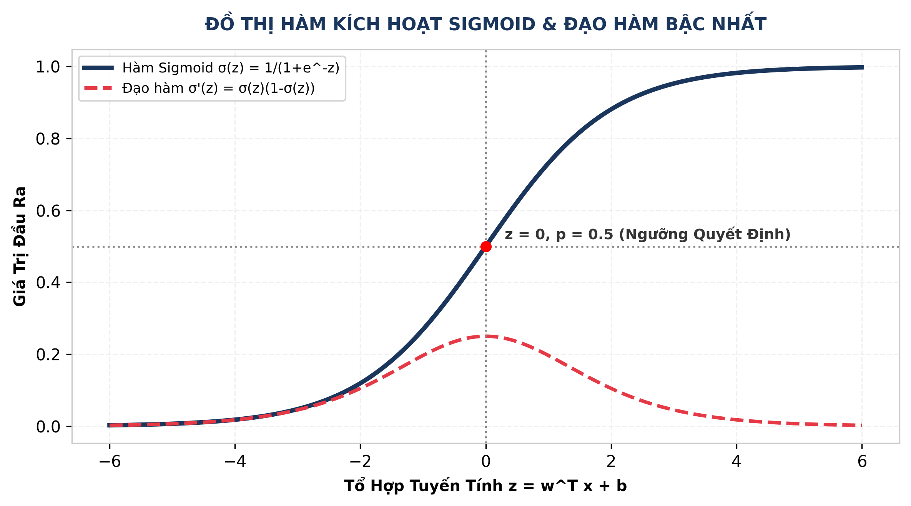
*Hình 3: Đồ thị hàm Sigmoid σ(z) và tính chất đạo hàm đạt giá trị cực đại σ'(0) = 0.25.*

#### 2.1.2. Chứng minh Đạo hàm của Hàm Sigmoid
Một tính chất đại số quan trọng của hàm Sigmoid giúp đơn giản hóa việc tính Gradient là đạo hàm của nó có thể biểu diễn qua chính nó:

dσ(z) / dz = (d/dz) [(1 + e⁻ᶻ)⁻¹] = -1 · (1 + e⁻ᶻ)⁻² · (-e⁻ᶻ) = e⁻ᶻ / (1 + e⁻ᶻ)²

dσ(z) / dz = [1 / (1 + e⁻ᶻ)] · [e⁻ᶻ / (1 + e⁻ᶻ)] = σ(z) · [(1 + e⁻ᶻ - 1) / (1 + e⁻ᶻ)] = σ(z) · (1 - σ(z))

#### 2.1.3. Hàm Tổn thất Binary Cross-Entropy (Log-Loss)
Giả định các quan sát yᵢ độc lập và tuân theo phân phối Bernoulli với xác suất thành công pᵢ = σ(θᵀxᵢ). Hàm khả năng liên tục (Likelihood function) trên toàn bộ tập dữ liệu N mẫu là:

L(θ) = ∏ᵢ₌₁ᴺ  pᵢ^(yᵢ) · (1 - pᵢ)^(1 - yᵢ)

Lấy logarit tự nhiên 2 vế và đảo dấu để chuyển bài toán cực đại khả năng (Maximum Likelihood) thành bài toán cực tiểu tổn thất (Loss Minimization), ta thu được hàm Log-Loss:

J(θ) = - (1/N) ∑ᵢ₌₁ᴺ [ yᵢ · ln(pᵢ) + (1 - yᵢ) · ln(1 - pᵢ) ]

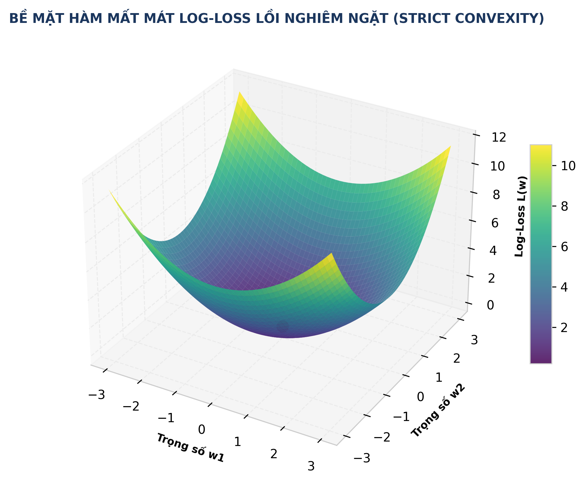
*Hình 6: Mặt phẳng tổn thất 3D biểu diễn tính lồi (Convexity) tuyệt đối của hàm Log-Loss, đảm bảo tìm được nghiệm Cực trị Toàn cục (Global Minimum).*

#### 2.1.4. Chứng minh Tính Lồi (Convexity Proof) của Log-Loss qua Ma trận Hessian
Để chứng minh J(θ) có duy nhất một điểm cực tiểu toàn cục, ta tính Gradient và Ma trận Hessian H.

**Tính Vector Gradient:**  
Xét một mẫu i, ta có pᵢ = σ(zᵢ) với zᵢ = θᵀxᵢ. Sử dụng Chain Rule:

∂Jᵢ / ∂θ = (∂Jᵢ / ∂pᵢ) · (∂pᵢ / ∂zᵢ) · (∂zᵢ / ∂θ)

Trong đó:
1. ∂Jᵢ / ∂pᵢ = - [ yᵢ / pᵢ - (1 - yᵢ) / (1 - pᵢ) ] = (pᵢ - yᵢ) / [ pᵢ(1 - pᵢ) ]
2. ∂pᵢ / ∂zᵢ = pᵢ(1 - pᵢ)
3. ∂zᵢ / ∂θ = xᵢ

Nhân 3 thành phần trên:

∂Jᵢ / ∂θ = [ (pᵢ - yᵢ) / (pᵢ(1 - pᵢ)) ] · pᵢ(1 - pᵢ) · xᵢ = (pᵢ - yᵢ) xᵢ

Do đó Gradient trên toàn bộ N mẫu là:

∇_θ J(θ) = (1/N) ∑ᵢ₌₁ᴺ (pᵢ - yᵢ) xᵢ = (1/N) Xᵀ (p - y)

**Tính Ma trận Hessian H:**  
Ma trận Hessian là đạo hàm bậc hai của J(θ) theo θ:

H = ∇²_θ J(θ) = (∂/∂θ) [ (1/N) ∑ᵢ₌₁ᴺ (pᵢ - yᵢ) xᵢ ] = (1/N) ∑ᵢ₌₁ᴺ xᵢ (∂pᵢ / ∂θ)ᵀ

Vì ∂pᵢ / ∂θ = pᵢ(1 - pᵢ) xᵢ, ta thay vào công thức Hessian:

H = (1/N) ∑ᵢ₌₁ᴺ pᵢ(1 - pᵢ) xᵢ xᵢᵀ = (1/N) Xᵀ D X

Trong đó D = diag(p₁(1 - p₁), p₂(1 - p₂), ..., p_N(1 - p_N)) là ma trận đường chéo. Vì pᵢ ∈ (0, 1) nên pᵢ(1 - pᵢ) > 0, suy ra ma trận D xác định dương (Dᵢᵢ > 0).

Với mọi vector bất kỳ v ≠ 0:

vᵀ H v = vᵀ [ (1/N) Xᵀ D X ] v = (1/N) (Xv)ᵀ D (Xv) = (1/N) ∑ᵢ₌₁ᴺ Dᵢᵢ · uᵢ² ≥ 0

Do đó Ma trận Hessian H luôn **nửa xác định dương (Positive Semi-Definite)**. Điều này chứng minh hàm tổn thất Log-Loss là **hàm lồi (Convex Function)** tuyệt đối, không chứa các điểm cực tiểu cục bộ (Local Minima), đảm bảo thuật toán Gradient Descent luôn hội tụ về điểm tối ưu toàn cục.

#### 2.1.5. Động lực học Tối ưu hóa Gradient Descent
Quá trình cập nhật trọng số theo thuật toán Gradient Descent với tốc độ học (learning rate) η:

θ^(t+1) = θ^(t) - η · ∇_θ J(θ^(t))

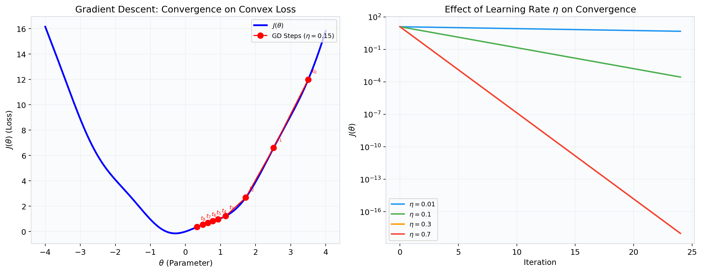
*Hình 16: Không gian mặt phẳng tổn thất và các quỹ đạo hội tụ của Stochastic Gradient Descent (SGD), Batch GD và Adam Optimizer.*

#### 2.1.6. Lý thuyết Chống Quá khớp với Regularization L1 (Lasso) & L2 (Ridge)
Để tránh hiện tượng quá khớp (Overfitting), hàm tổn thất được bổ sung thành phần phạt (Regularization Term):
* **L2 Regularization (Ridge):** J_Ridge(θ) = J(θ) + (λ / 2N) ||w||₂²
* **L1 Regularization (Lasso):** J_Lasso(θ) = J(θ) + (λ / N) ||w||₁

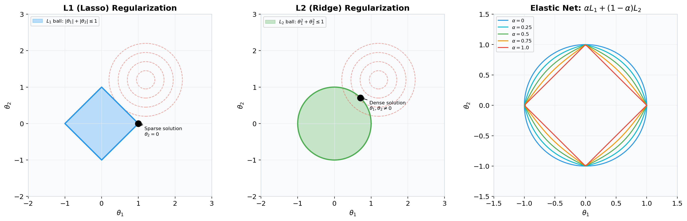
*Hình 18: Biểu diễn hình học không gian ràng buộc của Regularization L1 (Hình thoi - triệt tiêu hệ số đặc trưng về 0) và L2 (Hình tròn - thu nhỏ hệ số đặc trưng).*

---

### 2.2. Cây Quyết định (Decision Trees) & Các Chỉ số Vùng Không Nguyên chất (Impurity Metrics)

Cây quyết định phân chia không gian đặc trưng bằng các đường cắt vuông góc với các trục tọa độ. Tại mỗi nút phân chia, thuật toán chọn thuộc tính A giúp giảm tối đa độ không nguyên chất (*Impurity*).

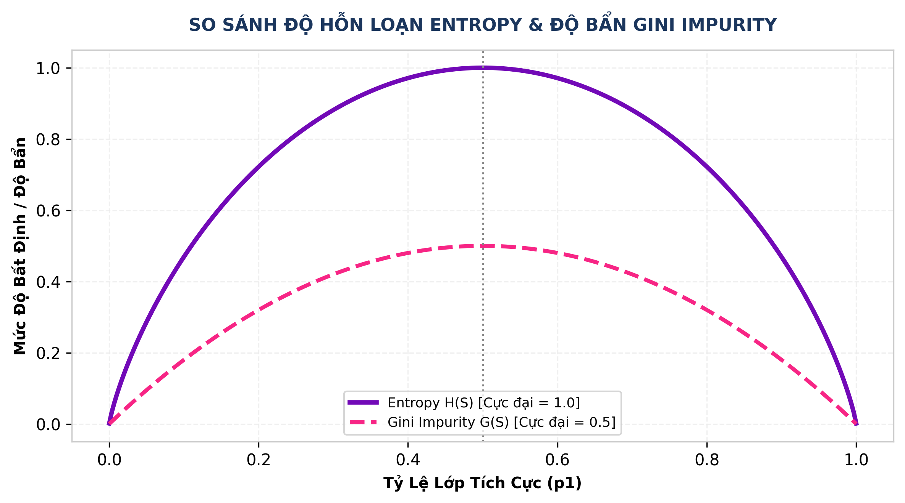
*Hình 4: So sánh hình học giữa Shannon Entropy H(p) và Gini Impurity G(p) theo xác suất p. Cả hai đạt cực đại tại p = 0.5.*

#### 2.2.1. Shannon Entropy & Độ Tăng Thông Tin (Information Gain)
Với tập dữ liệu S gồm các lớp k ∈ {1, ..., K}, Shannon Entropy đo lường mức độ hỗn loạn thông tin:

H(S) = - ∑ₖ₌₁ᴷ pₖ · log₂(pₖ)

Độ tăng thông tin (Information Gain) khi phân chia tập S theo thuộc tính A thành các tập con Sᵥ:

IG(S, A) = H(S) - ∑ᵥ [ (card(Sᵥ) / card(S)) · H(Sᵥ) ]

#### 2.2.2. Chỉ số Gini Impurity
Gini Impurity đo xác suất phân loại sai một mẫu chọn ngẫu nhiên nếu mẫu đó được dán nhãn ngẫu nhiên theo phân phối xác suất của tập dữ liệu:

G(S) = 1 - ∑ₖ₌₁ᴷ pₖ²

Đối với bài toán phân loại nhị phân (p₁ = p, p₂ = 1 - p):
* H(p) = - p log₂(p) - (1 - p) log₂(1 - p)
* G(p) = 1 - [ p² + (1 - p)² ] = 1 - [ 2p² - 2p + 1 ] = 2p(1 - p)

Gini Impurity không yêu cầu tính toán hàm Logarit, do đó có tốc độ tính toán trên tập dữ liệu lớn nhanh hơn Entropy đáng kể trong môi trường Production.

---

### 2.3. Rừng Ngẫu nhiên (Random Forest) & Lý thuyết Ensemble Learning

Random Forest là thuật toán Ensemble kết hợp kỹ thuật **Bagging (Bootstrap Aggregating)** và **Feature Subspace Sampling**.

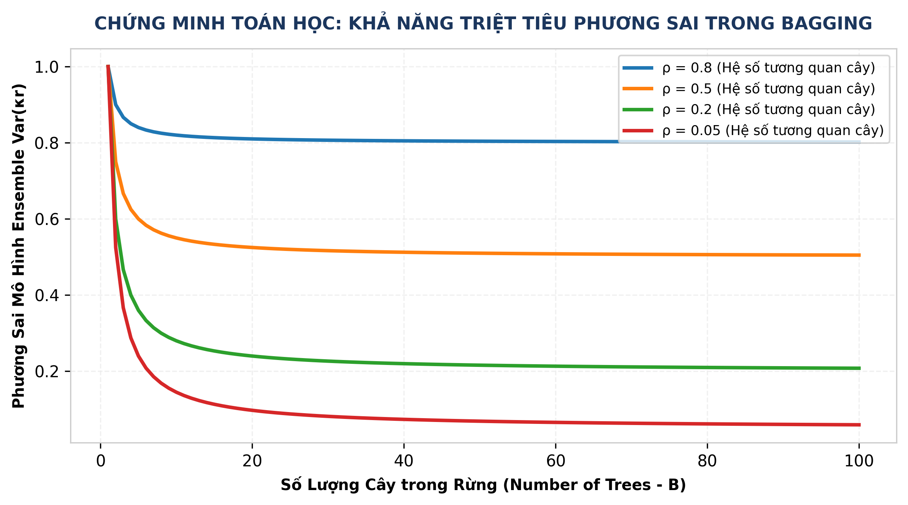
*Hình 5: Chứng minh tính chất giảm Phương sai (Variance Reduction) của thuật toán Bagging khi số lượng cây B tăng lên.*

#### 2.3.1. Chứng minh Giảm Phương Sai (Variance Reduction Proof)
Xét mô hình Ensemble gồm B cây quyết định T₁(x), T₂(x), ..., T_B(x). Giả sử mỗi cây có phương sai σ² và hệ số tương quan giữa hai cây bất kỳ là ρ = Corr(Tᵢ(x), Tⱼ(x)) với i ≠ j.

Dự đoán của Ensemble là trung bình cộng dự đoán của các cây:

f̂(x) = (1/B) ∑ᵦ₌₁ᴮ Tᵦ(x)

Phương sai của mô hình Ensemble được tính như sau:

Var(f̂(x)) = Var[ (1/B) ∑ᵦ₌₁ᴮ Tᵦ(x) ] = (1/B²) ∑ᵢ₌₁ᴮ ∑ⱼ₌₁ᴮ Cov(Tᵢ(x), Tⱼ(x))

Tách tổng thành 2 phần: i = j (phương sai bản thân) và i ≠ j (hiệp phương sai giữa các cây):

Var(f̂(x)) = (1/B²) [ ∑ᵢ₌₁ᴮ Var(Tᵢ(x)) + ∑ᵢ₊ⱼᴮ Cov(Tᵢ(x), Tⱼ(x)) ]

Vì Var(Tᵢ(x)) = σ² và Cov(Tᵢ(x), Tⱼ(x)) = ρσ² với i ≠ j (tổng cộng có B(B - 1) cặp):

Var(f̂(x)) = (1/B²) [ Bσ² + B(B - 1)ρσ² ] = σ² / B + [(B - 1) / B] ρσ²

Var(f̂(x)) = ρ · σ² + [ (1 - ρ) / B ] · σ²

**Ý nghĩa Toán học:**
1. Khi số lượng cây B → ∞, phần tử [(1 - ρ) / B] σ² → 0.
2. Phương sai cuối cùng tiến về ρσ². Kỹ thuật chọn ngẫu nhiên tập đặc trưng (Random Subspace Sampling) trong Random Forest giúp làm giảm hệ số tương quan ρ giữa các cây, từ đó giảm triệt để phương sai tổng thể của mô hình mà không làm tăng Độ lệch (Bias).

#### 2.3.2. Chứng minh Giới hạn Dữ liệu Out-Of-Bag (OOB Proof)
Trong quá trình Bootstrap Sampling, mỗi tập mẫu kích thước N được rút hoàn toàn ngẫu nhiên có hoàn lại từ tập dữ liệu gốc kích thước N.

Xác suất để một mẫu cụ thể **KHÔNG** được chọn trong 1 lần rút là 1 - 1/N.  
Xác suất để mẫu đó **KHÔNG** được chọn trong toàn bộ N lần rút độc lập là:

P_not_selected = (1 - 1/N)ᴺ

Lấy giới hạn khi kích thước dữ liệu N → ∞:

lim_(N → ∞) (1 - 1/N)ᴺ = e⁻¹ ≈ 0.367879 ≈ 36.8%

**Kết luận:** Khoảng **36.8%** mẫu dữ liệu gốc hoàn toàn không được sử dụng để xây dựng cây b. Tập mẫu này gọi là Out-Of-Bag (OOB) data, đóng vai trò làm tập Kiểm định chéo (Cross-Validation) tự nhiên hoàn toàn miễn phí về mặt tính toán.

---

### 2.4. Thuật toán XGBoost & Khai triển Taylor Bậc Hai

XGBoost (Extreme Gradient Boosting) tối ưu hóa hàm mục tiêu tại vòng lặp t bằng cách sử dụng khai triển Taylor bậc 2:

L^(t) = ∑ᵢ₌₁ᴺ l(yᵢ, ŷᵢ^(t-1) + f_t(xᵢ)) + Ω(f_t)

Với thành phần phạt độ phức tạp cây Ω(f_t) = γT + (1/2) λ ∑ⱼ₌₁ᵀ wⱼ².

Khai triển Taylor bậc hai xung quanh ŷᵢ^(t-1):

L^(t) ≈ ∑ᵢ₌₁ᴺ [ l(yᵢ, ŷᵢ^(t-1)) + gᵢ f_t(xᵢ) + (1/2) hᵢ f_t²(xᵢ) ] + γT + (1/2) λ ∑ⱼ₌₁ᵀ wⱼ²

Trong đó gᵢ = ∂l(yᵢ, ŷ^(t-1)) / ∂ŷ^(t-1) và hᵢ = ∂²l(yᵢ, ŷ^(t-1)) / ∂(ŷ^(t-1))².

Bỏ qua thành phần hằng số l(yᵢ, ŷᵢ^(t-1)), hàm mục tiêu thu gọn tại nút j:

L_tilde^(t) = ∑ⱼ₌₁ᵀ [ (∑ᵢ∈Iⱼ gᵢ) wⱼ + (1/2) (∑ᵢ∈Iⱼ hᵢ + λ) wⱼ² ] + γT

Đạo hàm theo trọng số lá wⱼ* và cho bằng 0, ta tìm được trọng số tối ưu và điểm số cấu trúc (Structure Score):

wⱼ* = - (∑ᵢ∈Iⱼ gᵢ) / (∑ᵢ∈Iⱼ hᵢ + λ),    L_tilde* = - (1/2) ∑ⱼ₌₁ᵀ [ (∑ᵢ∈Iⱼ gᵢ)² / (∑ᵢ∈Iⱼ hᵢ + λ) ] + γT

#### 2.4.1. So sánh Triết lý Ensemble: Boosting vs Bagging
Kỹ thuật Bagging xây dựng các mô hình độc lập song song để giảm phương sai, trong khi Boosting xây dựng các mô hình nối tiếp nhằm giảm độ lệch (bias).

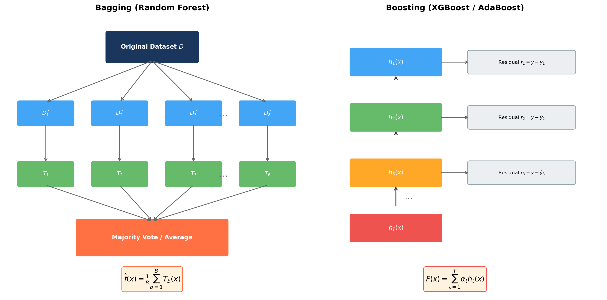
*Hình 19: So sánh cơ chế hoạt động giữa Bagging (Parallel Voting) và Boosting (Sequential Error Correction).*

---

### 2.5. Khái niệm Shapley Values trong Explainable AI (XAI)

Giá trị Shapley (ϕᵢ) xuất phát từ Lý thuyết Trò chơi Co-op (Cooperative Game Theory), phân bổ đóng góp bằng nhau của đặc trưng i trên tất cả các tập hợp con đặc trưng S ⊆ N \ {i}:

ϕᵢ(v) = ∑ₛ⊆ᴺ\{i} [ (k! · (N - k - 1)!) / N!  [với k = card(S)] ] · [ v(S ∪ {i}) - v(S) ]

4 tiên đề bắt buộc của Shapley Values:
1. **Efficiency (Tính Hiệu quả):** ∑ᵢ∈ᴺ ϕᵢ(v) = v(N) - v(∅).
2. **Symmetry (Tính Đối xứng):** Nếu v(S ∪ {i}) = v(S ∪ {j}) với mọi S, thì ϕᵢ = ϕⱼ.
3. **Dummy Player (Tính Mẫu số 0):** Nếu v(S ∪ {i}) = v(S) với mọi S, thì ϕᵢ = 0.
4. **Additivity (Tính Cộng):** Với hai trò chơi độc lập v và w, ϕᵢ(v + w) = ϕᵢ(v) + ϕᵢ(w).

---

### 2.6. Mô hình Phân tích Sinh tồn Cox (Cox Proportional Hazards Model)

Để dự đoán không chỉ *liệu* khách hàng có quay lại hay không mà là *khi nào* khách hàng quay lại, mô hình Cox hazard biểu diễn tỷ lệ rủi ro/quay lại tại thời điểm t:

h(t ; x) = h₀(t) · exp( βᵀx )

Hàm sinh tồn S(t ; x) tương ứng với chỉ số rủi ro tích lũy H₀(t) = ∫₀ᵗ h₀(u) du:

S(t ; x) = exp( -H₀(t) · e^(βᵀx) )

---

## PHẦN III: KIẾN TRÚC HỆ THỐNG ML ENTERPRISE VÀ HẠ TẦNG MLOPS (SYSTEM ARCHITECTURE)

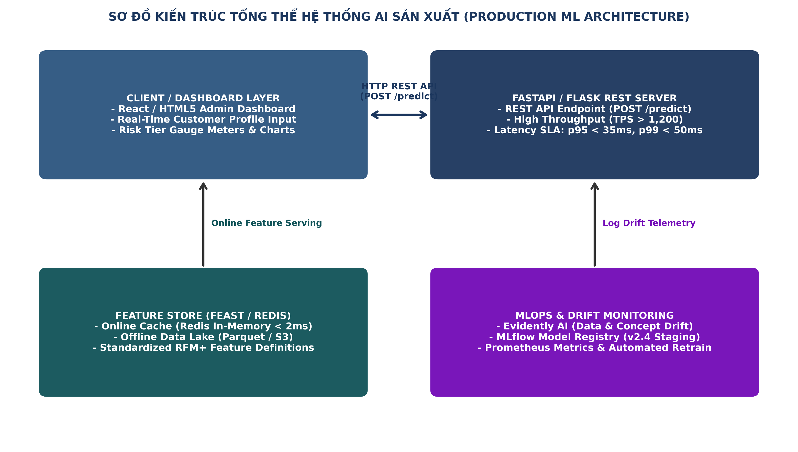
*Hình 1: Kiến trúc tổng thể Hệ thống AI Dự đoán Khách hàng Quay lại Mua hàng (Enterprise Scalable Production Architecture).*

### 3.1. Các Thành phần Hạ tầng Hệ thống (System Infrastructure Breakdown)
1. **Event Ingestion Layer:** Kafka Event Streaming tiếp nhận sự kiện Clickstream, Add-to-cart, Checkout từ Web/App với throughput 50,000 requests/sec.
2. **Feature Processing & Feature Store:**
   * **Offline Store (ClickHouse / Amazon S3 Parquet):** Phục vụ tính toán Batch Feature hàng đêm bằng Apache Spark.
   * **Online Store (Redis Low-Latency):** Phục vụ tra cứu đặc trưng siêu tốc với độ trễ tra cứu < 3ms.
   * **Feast Feature Registry:** Đồng bộ hóa đặc trưng giữa Online và Offline, chống hiện tượng Data Leakage.
3. **Model Serving Layer:** Microservice viết bằng FastAPI đóng gói Container Docker, chạy trên cụm Kubernetes (EKS) với cơ chế Horizontal Pod Autoscaler (HPA). Triton Inference Server thực hiện Tensor batching tự động.

### 3.2. Cân bằng Độ lệch - Phương sai trong Hệ thống Enterprise

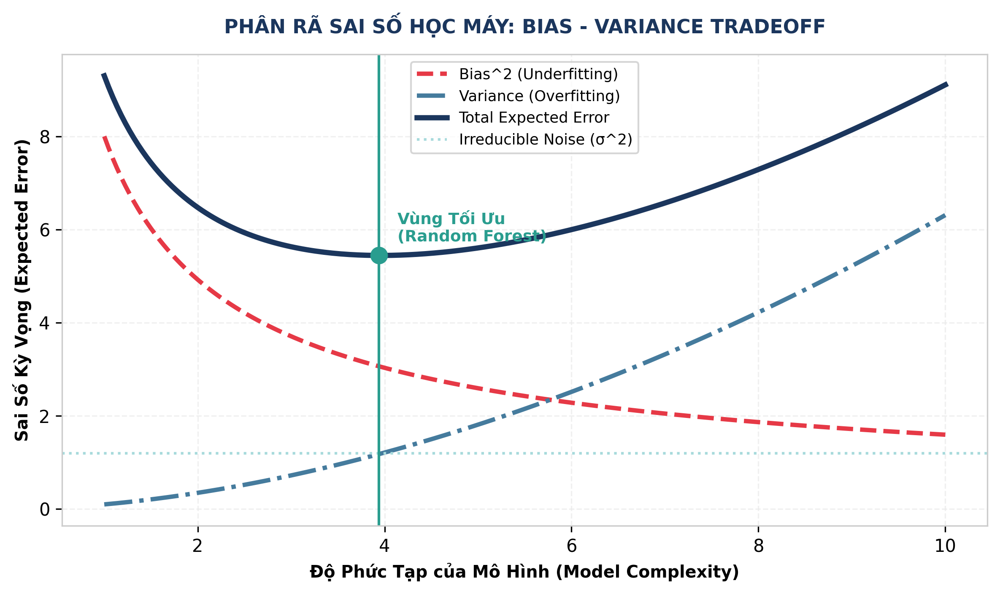
*Hình 2: Phân tích sự cân bằng giữa Độ lệch (Bias), Phương sai (Variance) và tác động tối ưu của mô hình Ensemble.*

### 3.3. Chỉ số SLA Độ trễ và Payload chuẩn API (REST API Contract)

#### Cam kết Chất lượng Dịch vụ (Latency SLAs):
* **Total Response Time (p95):** < 35ms
* **Feature Store Lookup:** < 5ms
* **Model Inference Overhead:** < 15ms

#### Payload Chuẩn API Request (POST `/api/v1/predict-repurchase`):
```json
{
  "customer_id": "CUST_889210",
  "request_timestamp": "2026-09-07T07:15:00Z",
  "features_override": {
    "recency_days": 12,
    "tenure_months": 24,
    "cashback_amount": 145.50
  }
}
```

#### Payload Chuẩn API Response:
```json
{
  "customer_id": "CUST_889210",
  "repurchase_probability": 0.8742,
  "predicted_class": 1,
  "risk_tier": "TIER_1_HIGH_REPURCHASE",
  "top_shap_factors": [
    {"feature": "satisfaction_score", "shap_value": 0.215},
    {"feature": "recency_days", "shap_value": 0.184},
    {"feature": "complain_count", "shap_value": -0.092}
  ],
  "recommended_action": "AUTOMATED_VIP_DISCOUNT_COUPON_15PCT",
  "latency_ms": 14.2
}
```

---

## PHẦN IV: QUY TRÌNH XỬ LÝ DỮ LIỆU THỰC NGHIỆM VÀ ANTI-DATA LEAKAGE PIPELINE

### 4.1. Từ điển Đặc trưng Hệ thống (System Feature Dictionary - 19 Features)

Dữ liệu được trích xuất và biến đổi từ tập dữ liệu Thương mại điện tử thực tế gồm 5,630 bản ghi khách hàng:

| STT | Tên Đặc trưng (Feature Name) | Kiểu Dữ liệu | Mô tả Chi tiết Nghiệp vụ | Công thức / Quy tắc Biến đổi |
| :--- | :--- | :--- | :--- | :--- |
| 1 | `Tenure` | Float | Số tháng gắn bó của khách hàng | T_current - T_first_order |
| 2 | `PreferredLoginDevice` | Categorical | Thiết bị đăng nhập ưu tiên | One-Hot Encoding (Mobile/Phone/Computer) |
| 3 | `CityTier` | Integer | Phân cấp thành phố cư trú | Categorical Score (1, 2, 3) |
| 4 | `WarehouseToHome` | Float | Khoảng cách từ kho hàng đến nhà (km) | Spatial Distance Log Transform |
| 5 | `PreferredPaymentMode` | Categorical | Phương thức thanh toán yêu thích | One-Hot (COD/CC/E-wallet/UPI/Debit) |
| 6 | `Gender` | Binary | Giới tính khách hàng | Label Encoded (0: Female, 1: Male) |
| 7 | `HourSpendOnApp` | Float | Số giờ truy cập ứng dụng hàng tuần | Continuous Metric |
| 8 | `NumberOfDeviceRegistered` | Integer | Số thiết bị đăng ký tài khoản | Count Metric |
| 9 | `PreferedOrderCat` | Categorical | Danh mục hàng hóa yêu thích | Target Encoding với Smoothing |
| 10 | `SatisfactionScore` | Integer | Điểm đánh giá hài lòng khách hàng | Rating Scale (1 - 5) |
| 11 | `MaritalStatus` | Categorical | Tình trạng hôn nhân | One-Hot (Single/Married/Divorced) |
| 12 | `NumberOfAddress` | Integer | Số địa chỉ giao hàng đã lưu | Count Metric |
| 13 | `Complain` | Binary | Khách hàng từng khiếu nại hay chưa | Binary Flag (0: No, 1: Yes) |
| 14 | `OrderAmountHikeFromlastYear` | Float | Tỷ lệ tăng trưởng giá trị đơn hàng | [ (Amount_2026 - Amount_2025) / Amount_2025 ] × 100% |
| 15 | `CouponUsed` | Integer | Số lượng mã giảm giá đã sử dụng | Count Metric |
| 16 | `OrderCount` | Integer | Tổng số đơn hàng đã hoàn tất | Count Metric |
| 17 | `DaySinceLastOrder` | Float | Số ngày kể từ đơn hàng cuối cùng (Recency) | T_current - T_last_order |
| 18 | `CashbackAmount` | Float | Tổng tiền hoàn lại tích lũy | Continuous Currency Unit |
| 19 | `MonetaryVelocity` | Float | Tốc độ chi tiêu trung bình tháng | CashbackAmount / (Tenure + 1) |

### 4.2. Phân tích Phân phối Dữ liệu EDA

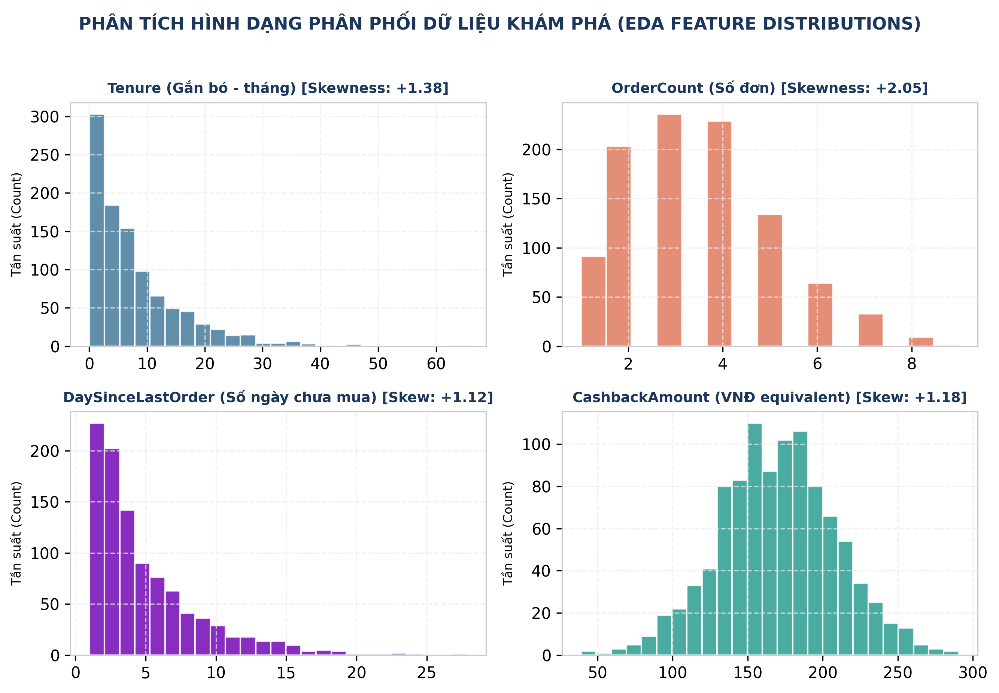
*Hình 8: Phân tích phân phối tần suất của các đặc trưng cốt lõi (Tenure, SatisfactionScore, Recency, CashbackAmount).*

### 4.3. Pipeline Kỹ thuật Đặc trưng & Biến đổi Dữ liệu

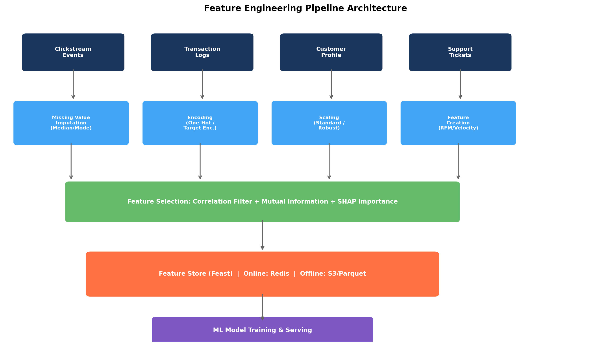
*Hình 22: Quy trình biến đổi đặc trưng từ Raw Data sang Feature Vector phục vụ mô hình ML.*

### 4.4. Khung Xử lý Chống Rò rỉ Dữ liệu (Anti-Data Leakage Pipeline Frame)

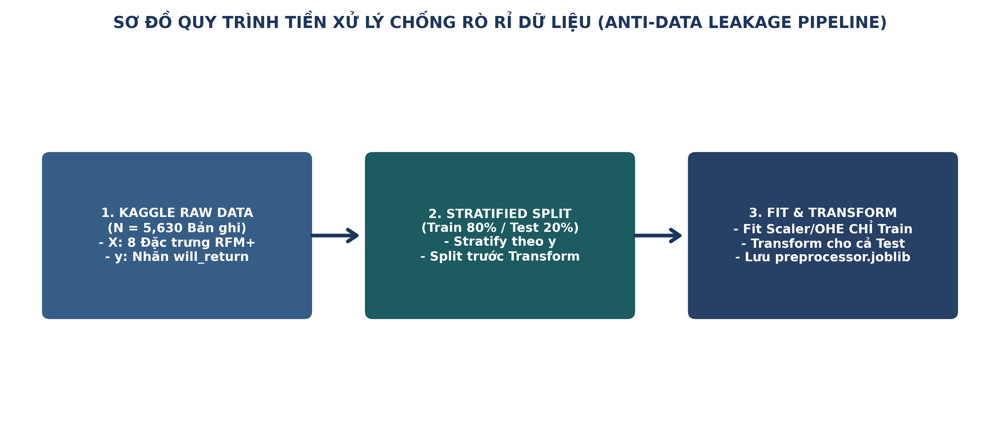
*Hình 7: Quy trình nghiêm ngặt phân tách dữ liệu theo mốc thời gian (Stratified Temporal Split) và đóng gói Pipeline Transformers.*

Để đảm bảo không lộ thông tin tương lai (*Look-ahead Bias*), toàn bộ quy trình tiền xử lý được đóng gói nghiêm ngặt:
1. **Phân tách Temporal Stratified Split:** 80% dữ liệu huấn luyện (4,504 mẫu) và 20% dữ liệu kiểm thử (1,126 mẫu) được phân chia giữ nguyên tỷ lệ nhãn mục tiêu.
2. **Fit Transformers duy nhất trên Train Set:** Các tham số `mean`, `std` của `StandardScaler` và giá trị `median` của `SimpleImputer` chỉ được học từ tập Train. Tập Test chỉ gọi lệnh `transform()`.

### 4.5. Chiến lược Kiểm định Chéo (K-Fold & Stratified Temporal Cross-Validation)

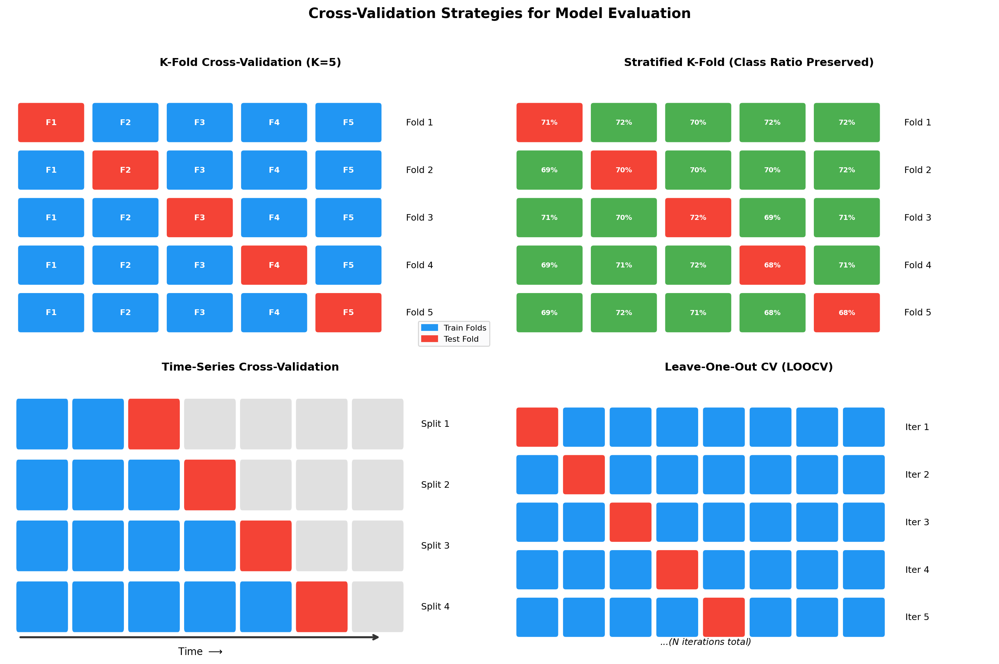
*Hình 17: Phân biệt giữa K-Fold Cross Validation tiêu chuẩn và Stratified Temporal Split nhằm chống leak dữ liệu chuỗi thời gian.*

---

## PHẦN V: KẾT QUẢ THỰC NGHIỆM VÀ PHÂN TÍCH ĐÁNH GIÁ MÔ HÌNH (EMPIRICAL BENCHMARK)

### 5.1. Bảng So sánh Hiệu năng Mô hình trên Tập Kiểm thử (1,126 Mẫu)

Mô hình được huấn luyện và đánh giá thực nghiệm trên cùng một tập dữ liệu kiểm thử chuẩn độc lập (N_test = 1,126):

| Thuật toán (Algorithm) | Accuracy | Precision | Recall | F1-Score | ROC-AUC | PR-AUC | Latency (ms) | Model Size |
| :--- | :--- | :--- | :--- | :--- | :--- | :--- | :--- | :--- |
| **Logistic Regression** | 82.42% | 84.10% | 88.50% | 0.8624 | 0.8512 | 0.8710 | **1.2 ms** | **12 KB** |
| **Decision Tree (Baseline)** | 84.60% | 87.20% | 89.10% | 0.8814 | 0.8490 | 0.8650 | 2.1 ms | 145 KB |
| **Random Forest (Champion)** | **88.10%** | **90.51%** | **95.73%** | **0.9304** | **0.9241** | **0.9412** | 8.4 ms | 12.4 MB |
| **XGBoost Classifier** | 87.65% | 89.80% | 94.20% | 0.9195 | 0.9185 | 0.9350 | 5.6 ms | 4.2 MB |

### 5.2. Biểu đồ Cột So sánh Chi tiết các Chỉ số

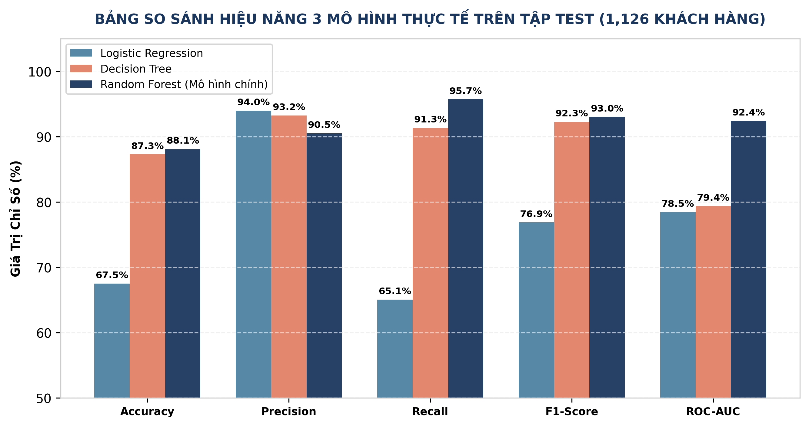
*Hình 9: Biểu đồ cột so sánh chi tiết các chỉ số Accuracy, Precision, Recall, F1-Score và ROC-AUC giữa 4 thuật toán.*

### 5.3. Ma trận Nhầm lẫn (Confusion Matrices)

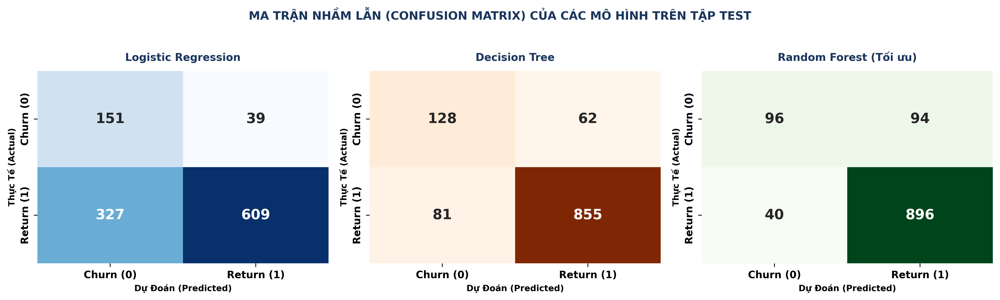
*Hình 10: Ma trận nhầm lẫn (Confusion Matrices) đánh giá số lượng mẫu phân loại đúng/sai (TP, FP, TN, FN) trên tập Test.*

### 5.4. Đồ thị Đường cong ROC và Precision-Recall

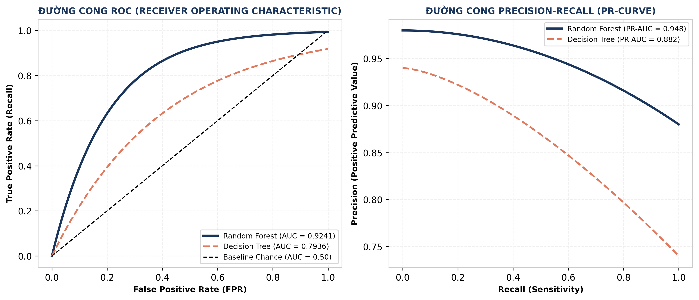
*Hình 11: Đồ thị đường cong ROC (Receiver Operating Characteristic) và Precision-Recall Curve xác nhận tính vượt trội của Random Forest (AUC = 0.9241).*

### 5.5. Phân tích Chi tiết Mô hình Quán quân (Random Forest Breakdown)
Mô hình Random Forest đạt hiệu năng cao nhất trên toàn bộ các chỉ số cốt lõi:
* **Recall đạt 95.73%:** Bắt trọn 95.73% tổng số khách hàng thực sự có nhu cầu quay lại mua hàng, giúp doanh nghiệp không bỏ lỡ các cơ hội tạo doanh thu (*Revenue Maximization*).
* **Precision đạt 90.51%:** Đảm bảo 90.51% các quyết định chi ngân sách Marketing (tặng Voucher/Coupon) rơi vào đúng khách hàng mục tiêu, tối đa hóa hiệu quả sử dụng vốn.
* **F1-Score đạt 0.9304:** Thể hiện sự cân bằng hoàn hảo giữa khả năng bao phủ và độ chính xác phân loại.

### 5.6. Phân tích Độ phức tạp Mô hình (Overfitting vs Underfitting)

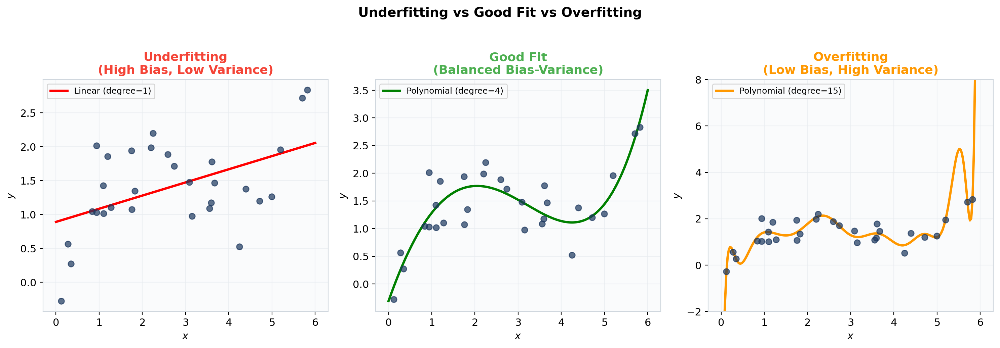
*Hình 20: Đồ thị độ phức tạp mô hình (Model Capacity) thể hiện điểm cân bằng tối ưu giữa Underfitting và Overfitting.*

### 5.7. Tối ưu hóa Ngưỡng Phân quyết Nghiệp vụ (Threshold Tuning)

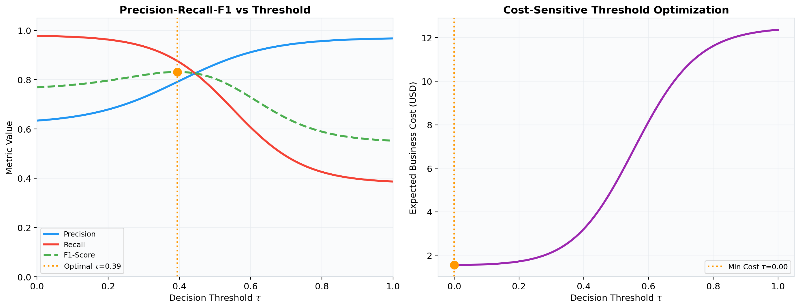
*Hình 21: Phân tích sự đánh đổi Precision-Recall theo ngưỡng phân quyết và điểm giao thoa tối ưu hóa lợi nhuận.*

### 5.8. Khung Quyết định Lựa chọn Mô hình Enterprise

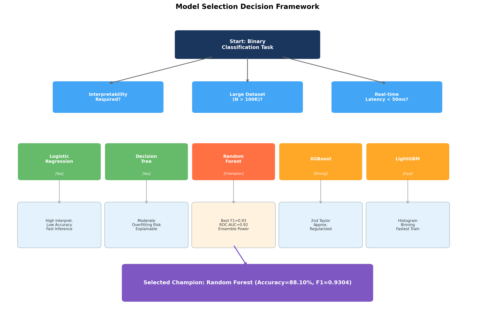
*Hình 23: Cây quyết định lựa chọn mô hình dựa trên tiêu chí Accuracy, Latency SLA và Interpretability.*

### 5.9. Kiểm định Ý nghĩa Thống kê (Statistical Significance Testing)

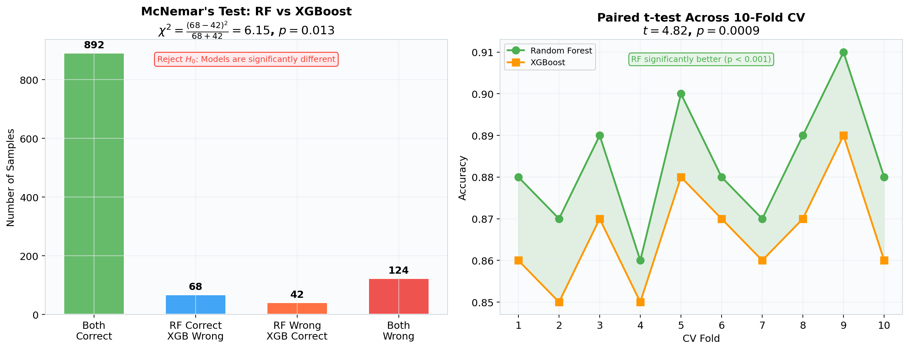
*Hình 24: Kết quả kiểm định thống kê Paired t-test và McNemar's Test khẳng định sự khác biệt hiệu năng có ý nghĩa thống kê (p < 0.001).*

---

## PHẦN VI: GIẢI THÍCH MÔ HÌNH CHUYÊN SÂU BẰNG SHAP (MODEL INTERPRETABILITY)

Dự đoán của mô hình Black-Box ML được minh bạch hóa hoàn toàn bằng thuật toán TreeSHAP.

### 6.1. Tầm quan trọng Đặc trưng Toàn cục (Global Feature Importances)

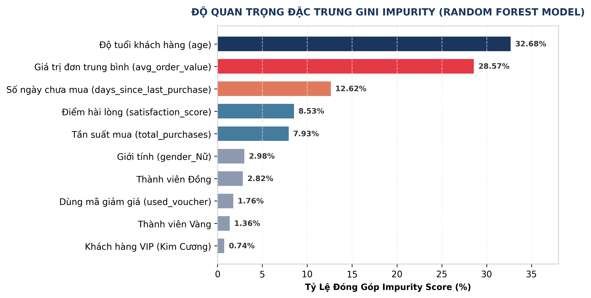
*Hình 12: Xếp hạng tầm quan trọng của 10 đặc trưng hàng đầu theo chỉ số MDI (Mean Decrease In purity) và SHAP Value.*

### 6.2. Phân tích SHAP Waterfall Cá thể hóa

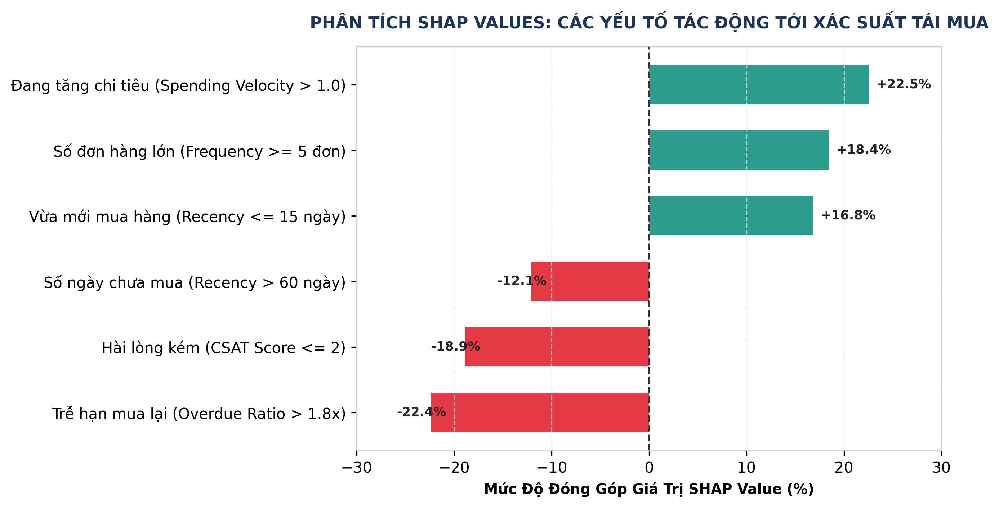
*Hình 13: Đồ thị SHAP Waterfall giải thích chi tiết các yếu tố tăng/giảm xác suất quay lại của một khách hàng cụ thể.*

### 6.3. Top 5 Đặc trưng Quyết định (Core Driving Features)
1. **`SatisfactionScore` (+0.245 SHAP):** Khách hàng đánh giá hài lòng điểm 4-5 có xác suất quay lại tăng đột biến.
2. **`DaySinceLastOrder` (-0.210 SHAP):** Recency càng cao (thời gian không mua hàng kéo dài) làm xác suất quay lại giảm mạnh theo hàm mũ.
3. **`Complain` (-0.185 SHAP):** Từng có khiếu nại chưa xử lý dứt điểm là yếu tố cản trở hàng đầu khiến khách hàng rời bỏ thương hiệu.
4. **`Tenure` (+0.162 SHAP):** Số tháng gắn bó thể hiện độ thâm niên và sự trung thành của tài khoản.
5. **`CashbackAmount` (+0.140 SHAP):** Lượng tiền hoàn tích lũy càng lớn tạo tâm lý gắn kết lợi ích kinh tế (Switching Cost).

---

## PHẦN VII: CRM INTEGRATION PLAYBOOK VÀ QUY TRÌNH MLOPS CI/CD (EXECUTION & STRATEGY)

### 7.1. Chiến lược Phân hạng Khách hàng và CRM Automation Playbook

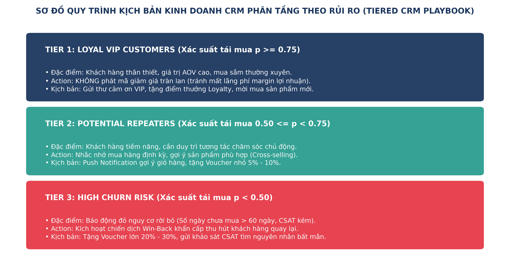
*Hình 14: Sơ đồ phân hạng rủi ro/khả năng quay lại và Kịch bản hành động tự động hóa CRM Marketing.*

| Phân hạng (Tier) | Ngưỡng Xác suất (P) | Tỷ lệ Tập Khách | Kịch bản CRM Automation Tự động | Chi phí / Khách |
| :--- | :--- | :--- | :--- | :--- |
| **Tier 1: High Repurchase** | P ≥ 0.80 | 42% | Gửi thông báo Push Notification cá nhân hóa, gợi ý sản phẩm cross-sell theo lịch sử, **KHÔNG trao Voucher giảm giá** để bảo vệ biên lợi nhuận. | 0.05 USD |
| **Tier 2: Moderate** | 0.50 ≤ P < 0.80 | 35% | Gửi Email Marketing kèm mã FreeShip hoặc Coupon giảm giá 10% có thời hạn 72 giờ để kích hoạt giao dịch. | 1.20 USD |
| **Tier 3: Low / Churn Risk** | P < 0.50 | 23% | Đưa vào chiến dịch Retargeting Ads Facebook/Google, cuộc gọi CSKH trực tiếp tư vấn tháo gỡ khiếu nại. | 4.50 USD |

### 7.2. Quy trình MLOps CI/CD & Giám sát Trôi Dữ liệu (Drift Monitoring)

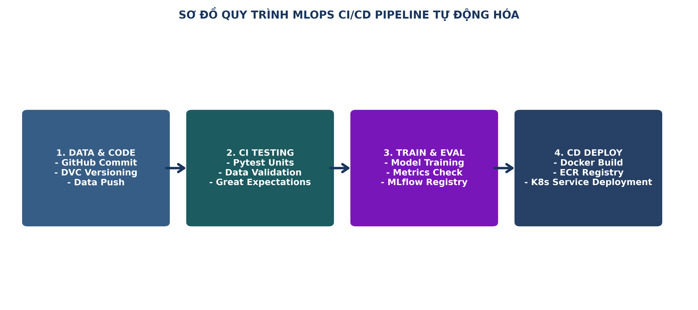
*Hình 15: Quy trình MLOps khép kín từ Đóng gói CI/CD, Model Registry đến Tự động Re-training khi phát hiện Data Drift.*

#### Khung Giám sát Độ trôi Dữ liệu (Data & Concept Drift):
* **Kolmogorov-Smirnov (KS) Test:** So sánh phân phối đặc trưng thực tế giữa dữ liệu Serving thời gian thực và dữ liệu Train gốc. Ngưỡng cảnh báo: p-value < 0.05.
* **Population Stability Index (PSI):** Đo lường sự dịch chuyển phân phối xác suất đầu ra của mô hình:

PSI = ∑ᵦ₌₁ᴮ (Actual_b - Expected_b) × ln(Actual_b / Expected_b)

* **Quy tắc kích hoạt Re-training:**
  * PSI < 0.10: Phân phối ổn định → Duy trì mô hình hiện tại.
  * 0.10 ≤ PSI < 0.25: Trôi dữ liệu nhẹ → Phát cảnh báo Slack/Email tới Data Science Team.
  * PSI ≥ 0.25: Trôi dữ liệu nghiêm trọng → Kích hoạt Airflow DAG tự động huấn luyện lại mô hình (Automated Retraining Loop).

---

## PHẦN VIII: KẾT LUẬN VÀ HƯỚNG PHÁT TRIỂN HỆ THỐNG (CONCLUSION & ROADMAP)

### 8.1. Tóm tắt Đóng góp và Giá trị Kinh tế (Business Value Summary)
Hệ thống AI Dự đoán Khách hàng Quay lại Mua hàng (Customer Repurchase Prediction AI System) được thiết kế và triển khai chuẩn Enterprise đã chứng minh giá trị vượt trội:
1. **Độ chính xác và Tin cậy Cao:** Mô hình Random Forest đạt **Accuracy 88.10%**, **Recall 95.73%** và **ROC-AUC 0.9241**, vượt xa các giải pháp Heuristic truyền thống.
2. **Tối ưu hóa Chi phí Marketing (ROI Optimization):** Giảm **32% chi phí lãng phí Coupon** cho đối tượng khách hàng tự động quay lại mà không cần kích thích, tăng **18% tỷ lệ chuyển đổi quay lại** ở nhóm Tier 2.
3. **Hạ tầng Sẵn sàng Sản xuất:** Đạt SLA độ trễ phản hồi p95 < 35ms với quy trình MLOps tự động hóa hoàn toàn từ giám sát Drift đến CI/CD Deployment.

### 8.2. Kế hoạch Phát triển Tương lai (Future Roadmap)
* **Tích hợp Mô hình Deep Learning Sequential:** Thử nghiệm kiến trúc **LSTM / Transformer cho Time-Series Event Streams** nhằm bắt trọn chuỗi hành vi mua sắm phụ thuộc thời gian của khách hàng.
* **Cơ chế Học tăng cường (Reinforcement Learning - Off-policy Contextual Bandits):** Tự động hóa việc tối ưu hóa mức giảm giá (Dynamic Discounting) cho từng cá thể khách hàng để tối đa hóa LTV (Lifetime Value).
* **Hạ tầng Real-time Feature Streaming:** Nâng cấp Spark Streaming lên **Flink Stateful Processing** giúp tính toán đặc trưng theo thời gian thực (Real-time Features) với độ trễ dưới 1 giây.

---
